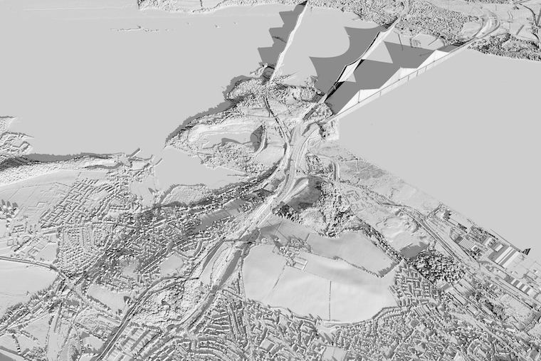

tqh
======

### Triangulated quadtree heightfield for raytracing gridded height data

## Build and run

Build the C-library
```bash
make all
```

In a python environment (with the checkout directory on the PYTHONPATH), try
```python
import tqh
# 4 tiles of data from remotesensingdata.gov.scot
# DSM Phase 5 - Crown copyright Scottish Government and Fugro (2020)
north_queensferry = tqh.load_tiles([['NT18SW_50CM_DSM_PHASE5.tif', 'NT18SE_50CM_DSM_PHASE5.tif'],
                                    ['NT17NW_50CM_DSM_PHASE5.tif', 'NT17NE_50CM_DSM_PHASE5.tif']])
tqh.perspective_shadow_lit(north_queensferry) # Needs matplotlib to display, or Pillow to if a save_name is supplied
```
(see also example in `examples/draw_nq.py`) to get sth. like
    

